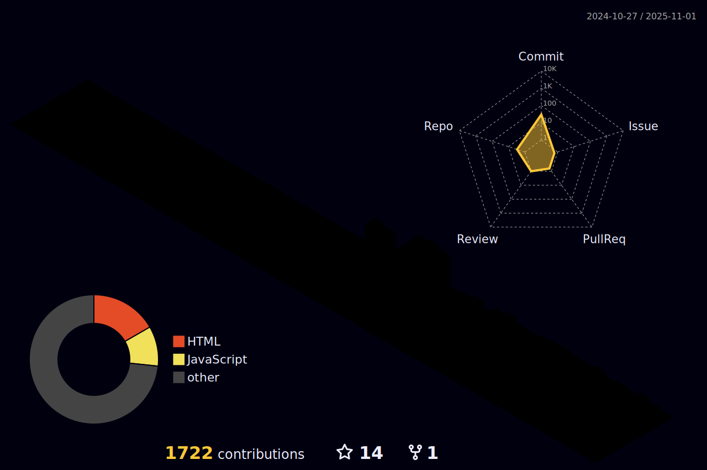

  <!-- Animated Header with Particle Background -->
  
  
  <!-- Animated Typing Text -->
  

  <!-- Animated View Counter -->
 

 

<!-- Animated Social Media Buttons with Hover Effects -->

  
  
  
  
  
  

<!-- Animated Separator -->

  

<!-- About Me Section with Animation -->
<h2 align="center">📌 About Me</h2>

  

<table align="center" width="100%" style="margin-top: 20px;">
  <tr>
    <td width="60%" valign="top">
      
I'm a passionate DevOps Engineer and Full Stack Developer who thrives on building scalable cloud solutions and optimizing development workflows. With expertise spanning cloud platforms, container orchestration, and modern web technologies, I help organizations achieve seamless CI/CD pipelines and robust infrastructure.

      
My mission is to bridge the gap between development and operations, creating efficient, secure, and automated systems that empower teams to deliver value faster.

      
Currently building <a href="https://cloudguard.pro">CloudGuard.PRO</a> and leading <a href="https://collabnation.io">CollabNation</a> 🚀

    </td>
    <td width="40%" align="center">
      <!-- Key skills/focus areas depicted as a chart -->
      
    </td>
  </tr>
</table>

<!-- Animated Separator -->

  

<!-- Tech Stack with Animation -->
<h2 align="center">🛠️ Tech Stack & Expertise</h2>

  
<b>☁️ Cloud & DevOps</b>

   
  

    
    
    
    
    
    
    
    
    
    
    
  

  
<b>💻 Development</b>

   
  

    
    
    
    
    
    
    
    
    
    
    
  

  
<b>🔧 Tools & Platforms</b>

   
  

    
    
    
    
    
    
    
    
    
  

<!-- Animated Separator -->

  

<!-- GitHub Stats with Animation -->
<h2 align="center">📊 GitHub Stats & Activity</h2>

  <!-- 3D Contribution Calendar -->
  <picture>
    
  </picture>
  
  <!-- Add a note about the 3D contribution calendar -->
  
<i>👆 3D contribution calendar powered by <a href="https://github.com/yoshi389111/github-profile-3d-contrib">github-profile-3d-contrib</a></i>

  <!-- GitHub Stats -->
  

  
  <!-- GitHub Stats -->
  

 

<!-- Animated Contribution Graph -->

  

<!-- Animated Separator -->

  

<!-- Current Focus with Animation -->
<h2 align="center">🎯 Current Focus Areas</h2>

  <!-- Focus Area 1 -->
  
  
  <!-- Focus Area 2 -->
  
  
  <!-- Focus Area 3 -->
  
  
  <!-- Focus Area 4 -->
  

 

<!-- Project Cards with Animation -->
<h2 align="center">🚀 Featured Projects</h2>

  <!-- Project 1 -->
  
  
  <!-- Project 2 -->
  

<!-- Animated Separator -->

  

<!-- Latest Blog Posts with Animation -->
<h2 align="center">📝 Latest Blog Posts</h2>

  <!-- This section can be dynamically updated using GitHub Actions -->
  <!-- BLOG-POST-LIST:START -->
  
   
  
   
  
  <!-- BLOG-POST-LIST:END -->
  
  
<a href="https://blog.himanshu.pro" target="_blank">➡️ More blog posts</a>

<!-- Skills Progression Bar -->
<h2 align="center">🔥 Skill Progression</h2>

  <!-- DevOps Skills -->
  <h4>DevOps</h4>
  
  
  
  
  <!-- Development Skills -->
  <h4>Development</h4>
  
  
  

<!-- Animated Separator -->

  

<!-- Get In Touch with Animation -->
<h2 align="center">📫 Let's Connect & Build Something Amazing!</h2>

  
I'm always open to collaborating on exciting projects and innovative ideas. Feel free to reach out for discussions on DevOps, cloud architecture, or full-stack development!

  
  

 

<!-- Fun Coding Animation at Bottom -->

  
   
  

<!-- Footer -->

  

<!-- Add this to your README to automatically update your 3D contributions calendar -->
<!--
### 🔄 Automated Updates
This profile is automatically updated with:
- Latest blog posts using GitHub Actions workflow
- 3D contribution calendar updated daily
- Dynamic project highlights based on pinned repositories
-->
